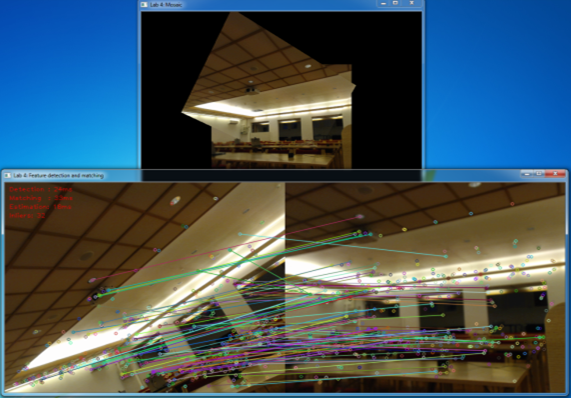

# Lab 4: Image mosaics from feature matching
Welcome to lab 4!

In this lab we will experiment with feature detection and matching to extract point correspondences between two images. 
We will then use these correspondences to estimate a homography between the images, and use this to map one image onto the other to create a mosaic.

Start by cloning this repository on your machine. Then open the lab project in CLion.

The lab is carried out by following these steps:
1. [Get an overview](lab-guide/1-get-an-overview.md)
2. [Features in OpenCV](lab-guide/2-features-in-opencv.md)
3. [Experiment with feature matching](lab-guide/3-experiment-with-feature-matching.md)
4. [Homography estimation](lab-guide/4-homography-estimation.md)
5. [Creating an image mosaic](lab-guide/5-creating-an-image-mosaic.md) 

At an appropriate time, [our proposed solution](https://github.com/tek5030/lab_04_solution) will be made available.

Please start the lab by going to the [first step](lab-guide/1-get-an-overview.md).
