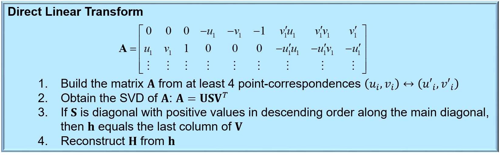
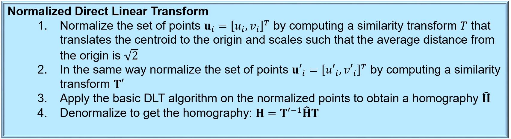
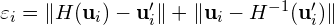
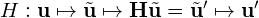
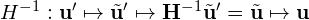

# Step 4: Homography estimation
Recall from the lectures that we can estimate a homography between two images from point correspondences using the Direct Linear Transform:

We can often achieve a better result if we perform the estimation on normalized point correspondences, using the Normalized DLT:

## 4. Understand how we estimate the homography
Lets take a look at how we have implemented all this math! 
First, study the class declaration and documentation in [homography_estimator.h](../homography_estimator.h). 
Then go to [homography_estimator.cpp](../homography_estimator.cpp):

- Look at `HomographyEstimator::dltEstimator`:
  - Try to identify steps 1-4 in the DLT above.
- Look at `HomographyEstimator::normalizedDltEstimator`:
  - Try to identify steps 1-3 in the normalized DLT above.
  - What does the normalizing similarity do?
- Look at `HomographyEstimator::ransacEstimator`:
  - How many point correspondences do we sample each iteration of the RANSAC loop? Why?
  - Which homography estimation algorithm do we use in the RANSAC loop? DLT or normalized DLT? Why not the other one?
  - This method returns a `PointSelection`. What is that? (Hint: Check [homography_estimator.h](../homography_estimator.h)).
- Look at `HomographyEstimator::estimate`:
  - This method returns a `HomographyEstimate`. What is that? (Hint: Check [homography_estimator.h](../homography_estimator.h))

## 5. Compute the reprojection error
To make the homography estimator work, we need to finish `HomographyEstimator::computeReprojectionError` in order to compute the *reprojection error* in the RANSAC inlier test.

In this context, reprojection error is a measure of how well a homography fits with a correspondence **u***i* &leftrightarrow; **u***i*`:

Here, *H* maps pixels from one image to the other according to

and *H*-1 is its inverse:

In `HomographyEstimator::computeReprojectionError` you need to compute the reprojection error for a point correspondence. 

Hint: Use [`Eigen::Matrixbase::homogeneous()`], [`Eigen::Matrixbase::hnormalized()`] and [`Eigen::Matrixbase::norm()`].

When you are happy with your implementation, compile and run the program. 
Choose a reference and perform matching by pressing *<space>*. 
Use debugging tools or printouts to the console to check that your implementation computes reasonable results.

You definitely want to compile and run the program in *release mode* (see [lab-corners](https://github.com/tek5030/lab-corners/blob/master/lab-guide/3-detect-circles-from-corners-with-ransac.md#compile-and-run-with-build-type-release)) when you are finished debugging.

Now, lets use the computed homography to combine the current frame with the reference in an image mosaic!
Please continue to the [next step](5-creating-an-image-mosaic.md).

[`Eigen::Matrixbase::homogeneous()`]: https://eigen.tuxfamily.org/dox/group__Geometry__Module.html#gaf3229c2d3669e983075ab91f7f480cb1
[`Eigen::Matrixbase::hnormalized()`]: https://eigen.tuxfamily.org/dox/group__Geometry__Module.html#gadc0e3dd3510cb5a6e70aca9aab1cbf19
[`Eigen::Matrixbase::norm()`]:        https://eigen.tuxfamily.org/dox/classEigen_1_1MatrixBase.html#a196c4ec3c8ffdf5bda45d0f617154975